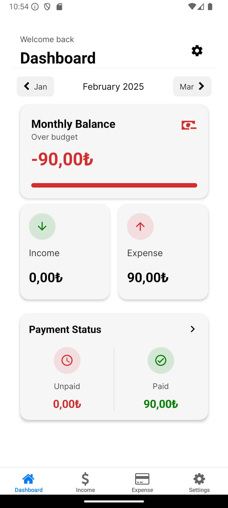
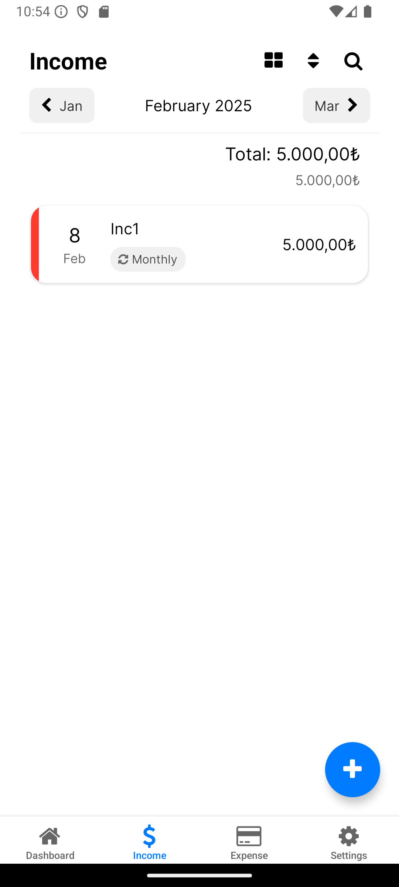
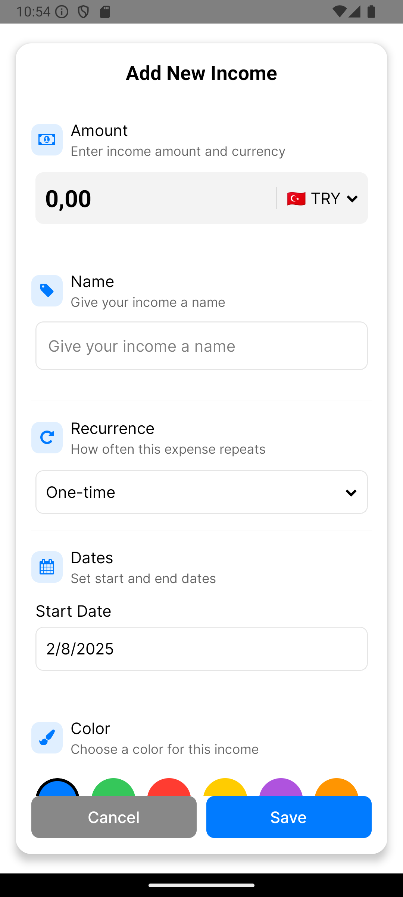
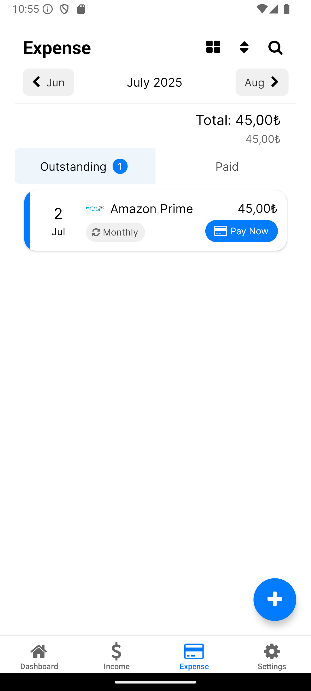
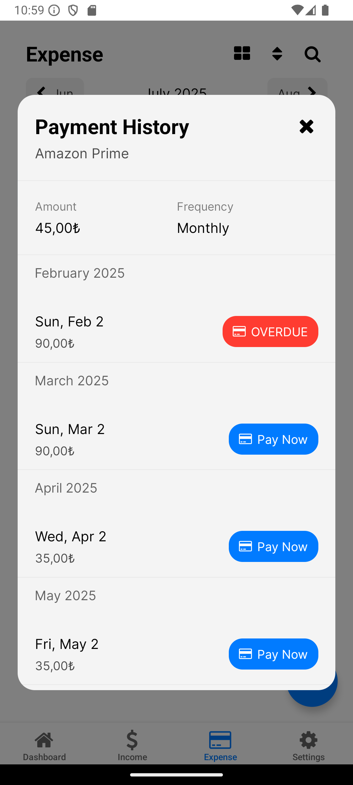
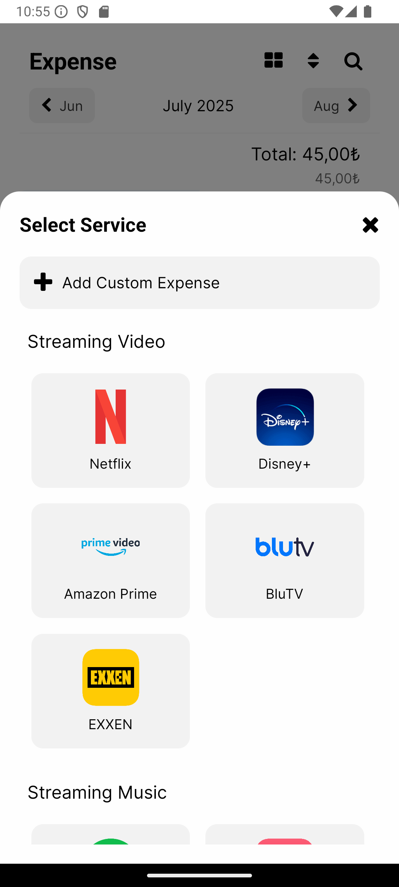
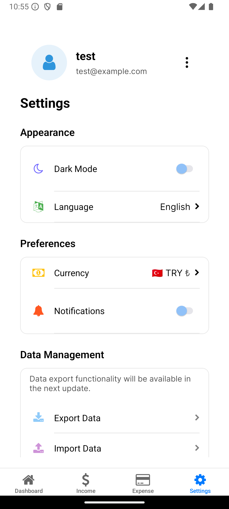
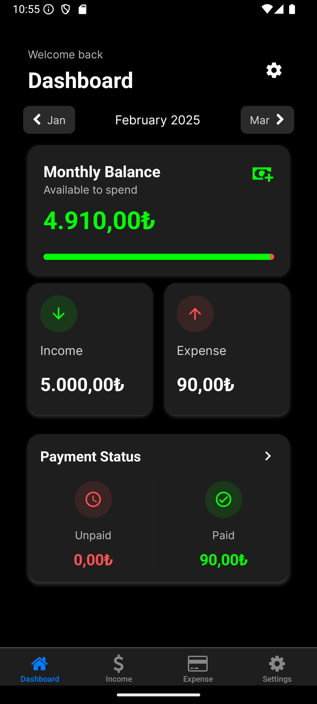
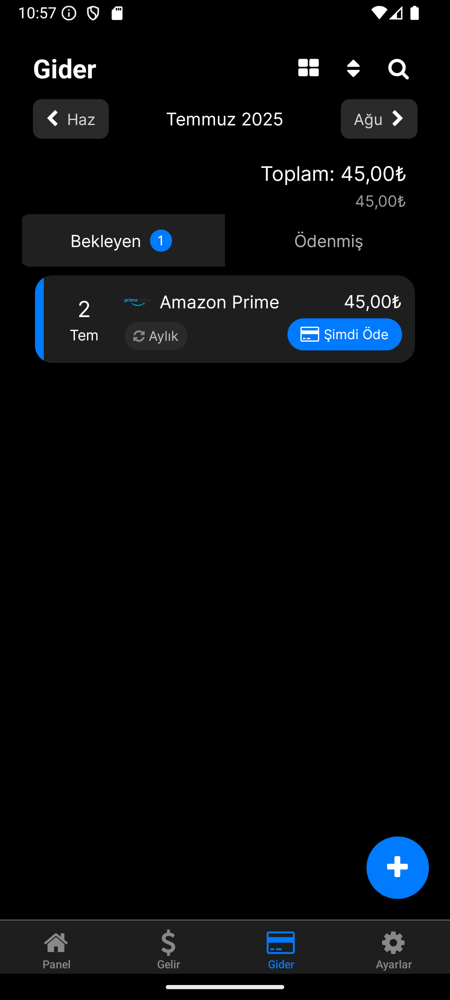

# PaySub

PaySub is a mobile application for managing subscriptions and expenses, helping users track their recurring payments and financial commitments.

## Features

- 📱 Cross-platform mobile application (iOS and Android)
- 💰 Expense tracking and management
- 🔔 Push notification reminders
- ⚙️ Customizable settings
- 🔒 Secure Firebase integration

## Screenshots

<div style="display: flex; flex-wrap: wrap; gap: 10px;">

### Home Screen



### Income Tracking



### Adding New Income



### Expense Tracking



### Payment History



### Adding New Expense



### Settings



### Dark Mode



### Turkish Language Support



</div>

## Tech Stack

- React Native / Expo
- Firebase (Authentication & Database)
- TypeScript
- Node.js

## Prerequisites

Before running this project, make sure you have the following installed:

- Node.js (v14 or higher)
- npm or yarn
- Expo CLI
- iOS Simulator (for Mac users) or Android Studio (for Android development)

## Installation

1. Clone the repository:

```bash
git clone [repository-url]
cd PaySub
```

2. Install dependencies:

```bash
npm install
# or
yarn install
```

3. Set up environment variables:
   Create a `.env` file in the root directory with the following variables:

```
# Firebase Configuration
FIREBASE_API_KEY=your_api_key
FIREBASE_AUTH_DOMAIN=your_auth_domain
FIREBASE_PROJECT_ID=your_project_id
FIREBASE_STORAGE_BUCKET=your_storage_bucket
FIREBASE_MESSAGING_SENDER_ID=your_messaging_sender_id
FIREBASE_APP_ID=your_app_id
```

4. Start the development server:

```bash
npx expo start
```

## Project Structure

- `/app` - Main application code and screens
- `/components` - Reusable React components
- `/services` - Service layer (Notifications, API calls)
- `/config` - Configuration files
- `/assets` - Static assets (images, fonts)

## API Documentation

All API endpoints require Bearer token authentication except for login and register.

### Authentication Endpoints

```typescript
// Register User
POST /api/auth/register
{
    "email": "string",
    "password": "string",
    "name": "string",
    "defaultCurrency": "string",  // e.g., "TRY", "USD"
    "language": "string"          // e.g., "en", "tr"
}

// Login User
POST /api/auth/login
{
    "email": "string",
    "password": "string"
}

// Get User Profile
GET /api/auth/profile

// Update Profile
PUT /api/auth/profile
{
    "name": "string",
    "defaultCurrency": "string",
    "language": "string",
    "notificationPreferences": {
        "defaultEnabled": boolean,
        "defaultDaysInAdvance": number,
        "defaultTime": {
            "hour": number,
            "minute": number
        }
    }
}
```

### Expense Endpoints

```typescript
// Get All Expenses
GET /api/expenses

// Get Expenses with Date Filter
GET /api/expenses?startDate=YYYY-MM-DD&endDate=YYYY-MM-DD

// Get Single Expense
GET /api/expenses/:id

// Create Expense
POST /api/expenses
{
    "amount": number,
    "currency": "string",
    "name": "string",
    "startDate": "string",      // ISO date format
    "color": "string",          // hex color code
    "recurrence": {
        "type": "monthly" | "yearly",
        "interval": number
    },
    "notification": {
        "enabled": boolean,
        "daysInAdvance": number,
        "time": {
            "hour": number,
            "minute": number
        }
    },
    "service": {
        "id": "string",
        "name": "string",
        "logo": "string",
        "customName": "string"
    }
}

// Update Expense
PUT /api/expenses/:id
{
    "amount": number,
    "name": "string",
    "recurrence": {
        "type": "monthly" | "yearly",
        "interval": number
    }
}

// Delete Expense
DELETE /api/expenses/:id

// Update Payment Status
PATCH /api/expenses/:id/payment
{
    "date": "string",    // ISO date format
    "isPaid": boolean
}
```

### Income Endpoints

```typescript
// Get All Incomes
GET /api/incomes

// Get Single Income
GET /api/incomes/:id

// Create Income
POST /api/incomes
{
    "amount": number,
    "currency": "string",
    "name": "string",
    "startDate": "string",    // ISO date format
    "color": "string",        // hex color code
    "recurrence": {
        "type": "monthly" | "yearly",
        "interval": number
    }
}

// Update Income
PUT /api/incomes/:id
{
    "amount": number,
    "name": "string"
}

// Delete Income
DELETE /api/incomes/:id
```

### Service Endpoints

```typescript
// Get All Services
GET /api/services

// Get Service Categories
GET /api/services/categories

// Get Services by Category
GET /api/services/category/:categoryId

// Search Services
GET /api/services/search?query=searchterm
```

### Response Format

All API endpoints return responses in the following format:

```typescript
{
    "success": boolean,
    "data"?: any,
    "error"?: {
        "code": string,
        "message": string
    }
}
```

### Common Error Codes

- `AUTH_001`: Authentication failed
- `AUTH_002`: Invalid credentials
- `AUTH_003`: Token expired
- `EXP_001`: Invalid expense data
- `EXP_002`: Expense not found
- `INC_001`: Invalid income data
- `NOT_001`: Invalid notification settings

### Base URL

For local development: `http://localhost:3000`

## Contributing

1. Fork the repository
2. Create your feature branch (`git checkout -b feature/AmazingFeature`)
3. Commit your changes (`git commit -m 'Add some AmazingFeature'`)
4. Push to the branch (`git push origin feature/AmazingFeature`)
5. Open a Pull Request

## License

This project is licensed under the MIT License - see the LICENSE file for details.

## Contact

Project Link: [[repository-url]](https://github.com/omerdikyol/PaySub)

---

Made with ❤️ by Ömer Dikyol
